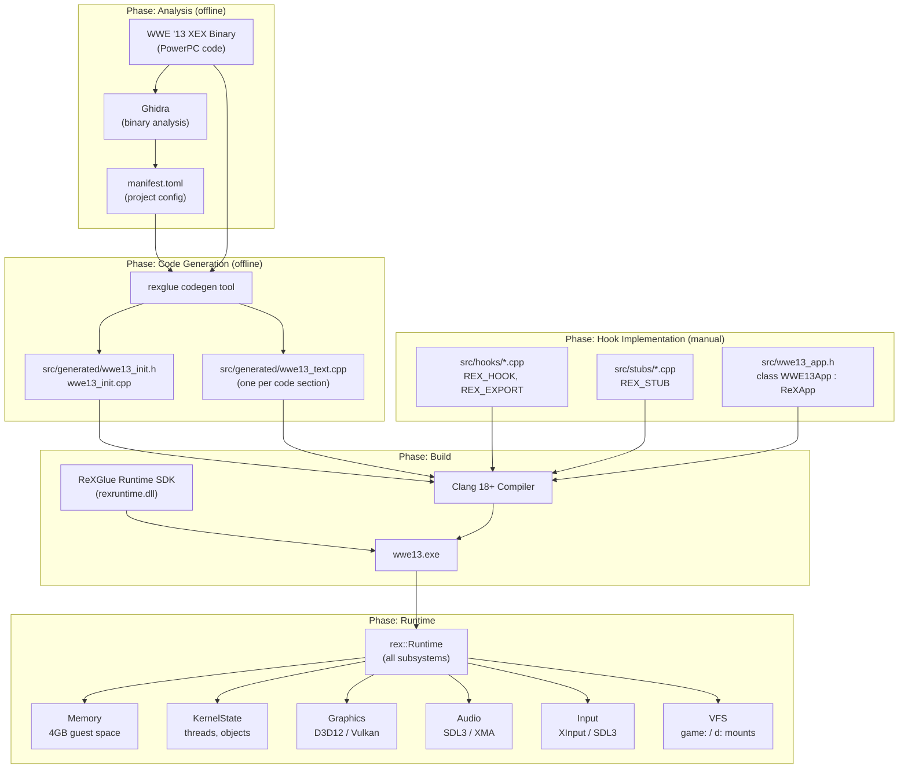
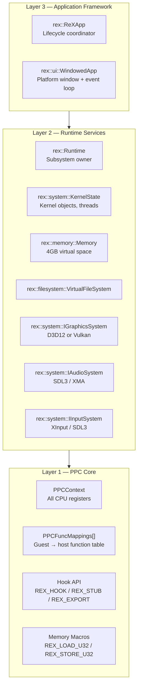
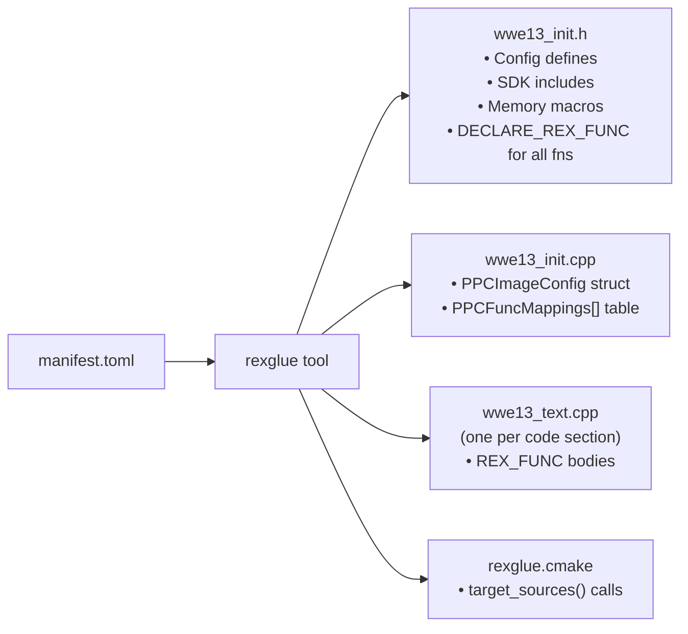
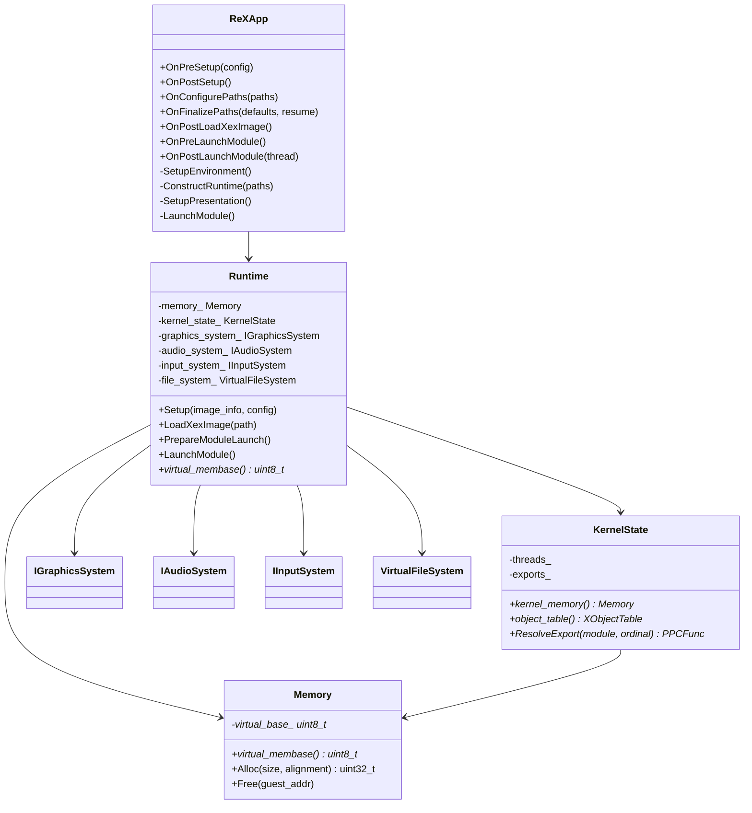
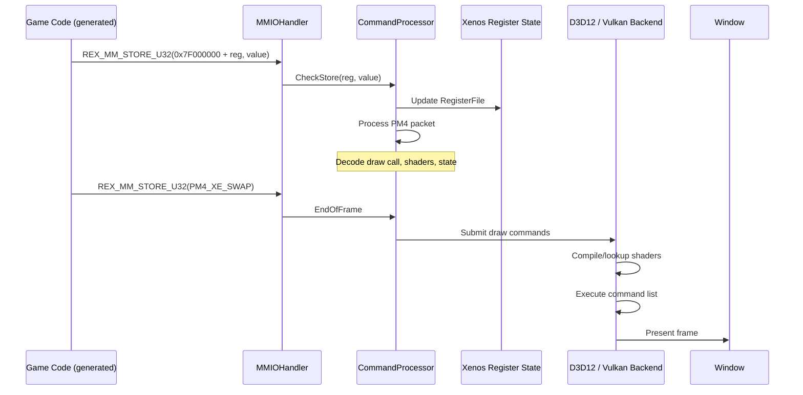
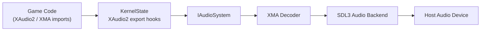
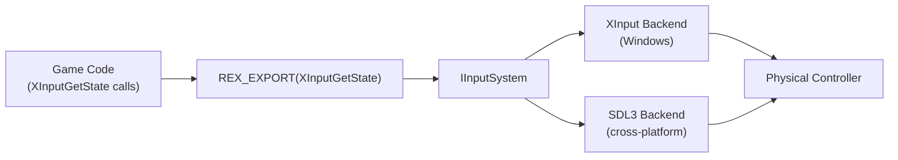
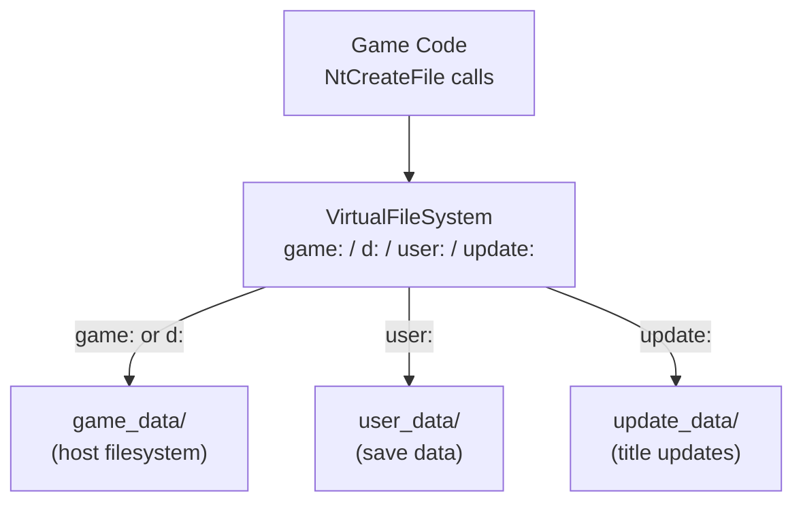
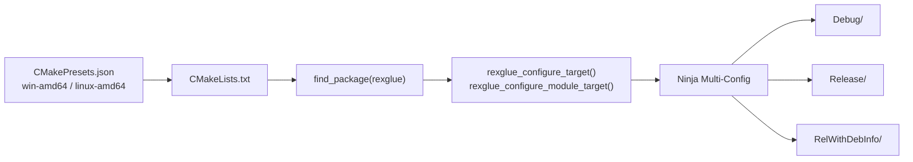

# Project Architecture

> System design and component relationships for the WWE '13 Recompilation project.

This document describes how all the pieces fit together: the repository layout, the ReXGlue SDK layers, the generated project, and each runtime subsystem. Diagrams use Mermaid syntax and render on GitHub.

---

## Table of Contents

- [High-Level System Diagram](#high-level-system-diagram)
- [Repository Layout](#repository-layout)
- [ReXGlue SDK Layers](#rexglue-sdk-layers)
- [Generated Project Structure](#generated-project-structure)
- [Runtime Architecture](#runtime-architecture)
- [Rendering Pipeline](#rendering-pipeline)
- [Audio Architecture](#audio-architecture)
- [Input Architecture](#input-architecture)
- [Asset Management and VFS](#asset-management-and-vfs)
- [Build System Architecture](#build-system-architecture)
- [Testing Architecture](#testing-architecture)

---

## High-Level System Diagram

This diagram shows how all major components relate from the WWE '13 binary to the running application.



---

## Repository Layout

```
wwe13-recompilation/
│
├── rexglue-sdk/                  # ReXGlue SDK (git submodule — do not modify)
│   ├── include/rex/              # All public SDK headers
│   ├── src/                      # SDK implementation
│   ├── cmake/                    # CMake helpers
│   └── resources/templates/      # Jinja2 code generation templates
│
├── src/                          # Project source (added as project progresses)
│   ├── generated/                # ← Output of rexglue codegen (do not edit)
│   │   ├── wwe13_init.h          # Master include: macros, declarations
│   │   ├── wwe13_init.cpp        # PPCImageConfig + PPCFuncMappings table
│   │   ├── wwe13_text.cpp        # Generated function bodies
│   │   └── rexglue.cmake         # CMake source file registration
│   ├── hooks/                    # REX_HOOK implementations
│   │   ├── xinput_hooks.cpp      # XInputGetState, XInputSetState
│   │   ├── audio_hooks.cpp       # XAudio2 kernel exports
│   │   └── graphics_hooks.cpp    # Xenos command processor hooks (if needed)
│   ├── stubs/                    # REX_STUB implementations
│   │   ├── xboxkrnl_stubs.cpp    # xboxkrnl.exe unimplemented exports
│   │   └── xam_stubs.cpp         # xam.xex unimplemented exports
│   ├── wwe13_app.h               # Application class: class WWE13App : rex::ReXApp
│   ├── wwe13_app.cpp             # Application class implementation
│   └── main.cpp                  # REX_DEFINE_APP(wwe13, WWE13App::Create)
│
├── docs/                         # Project documentation
├── cmake/                        # Project-specific CMake modules (if needed)
├── scripts/                      # Utility scripts
├── out/                          # Build output (git-ignored)
│   └── win-amd64/
│       ├── Debug/
│       ├── Release/
│       └── RelWithDebInfo/
│
├── README.md
├── ROADMAP.md
├── SETUP.md
├── DEVELOPMENT.md
├── CONTRIBUTING.md
├── CHANGELOG.md
├── LICENSE
├── .gitignore
├── CMakeLists.txt                # (to be created in Phase 4)
└── CMakePresets.json             # (to be created in Phase 4)
```

---

## ReXGlue SDK Layers

The SDK is organized into three conceptual layers:



Each layer depends only on layers below it. Your hook implementations sit between Layer 1 (calling conventions, memory access) and Layer 2 (kernel services).

---

## Generated Project Structure

The codegen tool produces a project that follows this structure:



Every `.cpp` function file includes `wwe13_init.h` at the top. This gives each translation unit access to all macros and declarations.

Example generated function (simplified):

```cpp
#include "generated/wwe13_init.h"

// Function at 0x82012ABC — originally: void UpdateEntityTransform(Entity* e)
DEFINE_REX_FUNC(sub_82012ABC) {
    REX_FUNC_PROLOGUE();
    // lwz r4, 0(r3)  — load entity pointer
    ctx.r4.u32 = REX_LOAD_U32(ctx.r3.u32);
    // addi r5, r4, 0x10  — pointer arithmetic
    ctx.r5.u32 = ctx.r4.u32 + 0x10;
    // stfs f1, 0(r5)  — store float
    REX_STORE_U32(ctx.r5.u32, *(u32*)&ctx.f1.f32);
    // blr
    return;
}
```

---

## Runtime Architecture



---

## Rendering Pipeline

The path from Xbox 360 game code to a rendered frame on screen:



### Key Components

| Component | Header | Description |
|-----------|--------|-------------|
| `CommandProcessor` | `graphics/command_processor.h` | Reads PM4 packets from the ring buffer |
| `RegisterFile` | `graphics/register_file.h` | Stores all Xenos GPU register values |
| `SharedMemory` | `graphics/shared_memory.h` | Manages GPU-visible host memory |
| `PrimitiveProcessor` | `graphics/primitive_processor.h` | Handles vertex format translation |
| D3D12 Backend | `graphics/d3d12/` | Windows-only rendering backend |
| Vulkan Backend | `graphics/vulkan/` | Cross-platform rendering backend |

---

## Audio Architecture



Audio hooks intercept XAudio2 source voice and mastering voice creation calls. Compressed XMA audio data from the XEX is decoded by an XMA decoder and fed to the SDL3 audio backend.

---

## Input Architecture



XInput hook implementations read the physical controller state and write it into a guest-memory `XINPUT_GAMEPAD` structure that the game code can read. The structure must be written in big-endian byte order.

---

## Asset Management and VFS



The VFS translates Xbox 360 virtual paths to host filesystem paths:

| Xbox 360 Path | Host Path |
|--------------|-----------|
| `game:\default.xex` | `game_data/default.xex` |
| `d:\media\music.xma` | `game_data/media/music.xma` |
| `user:\profile.bin` | `user_data/profile.bin` |

Path configuration is done in `WWE13App::OnConfigurePaths(PathConfig& paths)`.

---

## Build System Architecture



### Build Configurations

| Configuration | Optimizations | Debug Info | Tracy | Use Case |
|--------------|--------------|------------|-------|---------|
| Debug | None (`-O0`) | Full | Enabled | Development, step debugging |
| Release | Full (`-O3`, `-DNDEBUG`) | None | Disabled | Distribution |
| RelWithDebInfo | `-O2` | Full | Enabled | Profiling with Tracy |

---

## Testing Architecture

### PPC Instruction Tests (SDK level)

The ReXGlue SDK includes a PPC instruction test harness. These tests verify individual instruction translations are correct. They are enabled in the SDK build with `REXGLUE_BUILD_TESTS=ON`.

### Manual Regression Testing (project level)

At the project level, testing is observational:

| Phase | Pass Criteria |
|-------|-------------|
| Phase 4 | Application starts; no missing symbol assertions |
| Phase 5 | A frame appears on screen |
| Phase 6 | Audio device opens; no audio crash |
| Phase 7 | Controller navigation works |
| Phase 8 | Main menu loads; match starts |
| Phase 9 | 30 minutes of gameplay without crash |
| Phase 10 | Full game playable |

### Logging as a Test Signal

ReXGlue's logging system is the primary diagnostic tool. The `REXKRNL_WARN` messages from stubs tell you exactly which functions are being called and need implementation. A log file with zero stub warnings is a strong indicator of completion.

### Tracy Profiling

In `RelWithDebInfo` builds, Tracy profiler captures CPU timelines. Look for:
- Functions spending disproportionate time (unoptimized hot paths)
- Unexpected function call frequency (wrong frame rate, physics ticking too fast)
- Lock contention (thread synchronization issues)
