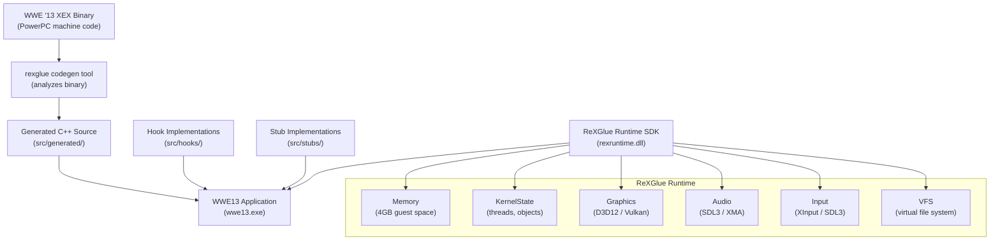
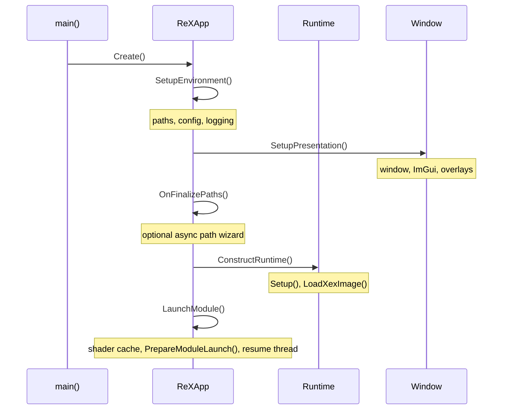

# ReXGlue SDK Reference

> A comprehensive technical reference for the ReXGlue SDK — the Xbox 360 static recompilation toolkit used by this project.

ReXGlue SDK version: **0.8.x** | License: **BSD 3-Clause** | Compiler: **Clang 18+** | Standard: **C++23**

---

## Table of Contents

- [What is ReXGlue?](#what-is-rexglue)
- [Project Philosophy](#project-philosophy)
- [Architecture Overview](#architecture-overview)
- [Directory Layout](#directory-layout)
- [How Recompilation Works](#how-recompilation-works)
- [The Codegen Pipeline](#the-codegen-pipeline)
- [Generated Files](#generated-files)
- [The Runtime SDK](#the-runtime-sdk)
- [The Hook API](#the-hook-api)
- [The Application Framework](#the-application-framework)
- [Build System](#build-system)
- [Common Terminology](#common-terminology)
- [Best Practices](#best-practices)

---

## What is ReXGlue?

ReXGlue is an **ahead-of-time static recompiler** for Xbox 360 executables. It reads a game's XEX binary, analyzes its PowerPC machine code function by function, and writes equivalent C++23 source code. That generated C++ is then compiled with Clang 18+ and linked against the ReXGlue runtime SDK to produce a native executable.

The key distinction from emulation: there is no interpreter, no JIT compiler, and no hardware simulation at runtime. The game code runs as compiled native C++. The runtime SDK replaces the Xbox 360's operating system services (kernel, file system, GPU, audio, input) with portable implementations.

ReXGlue builds on foundations from three prior projects:

| Project | Contribution |
|---------|-------------|
| [Project Xenia](https://github.com/xenia-project/xenia) | Xbox 360 kernel, Xenos GPU emulation, memory model |
| [XenonRecomp](https://github.com/hedge-dev/XenonRecomp) | Modern static recompilation approach, codegen analysis logic, instruction translations |
| [rexdex's recompiler](https://github.com/rexdex/recompiler) | Original static recompiler for Xbox 360 |

---

## Project Philosophy

ReXGlue is designed around a clear separation of concerns:

1. **Generated code is dumb.** The codegen tool translates instructions mechanically. Generated functions are verbose but straightforward — they read/write registers, load/store memory, and call other functions. No optimization at the codegen stage.

2. **Hooks are the customization point.** When the generated code calls a kernel function or a game function you want to replace, you write a `REX_HOOK`. The hook system is type-safe and zero-overhead.

3. **The runtime is a portable OS replacement.** It does not simulate Xbox 360 hardware — it replaces it with portable implementations that run on any supported platform.

4. **The application framework is a thin coordinator.** `rex::ReXApp` wires all the pieces together but stays out of the way. Subclasses override only what they need.

---

## Architecture Overview



---

## Directory Layout

```
rexglue-sdk/
├── include/rex/              # All public C++ headers
│   ├── ppc/                  # PPC context, function table, intrinsics, stack
│   ├── codegen/              # Codegen pipeline, manifest, config, analysis
│   ├── graphics/             # Xenos GPU: D3D12, Vulkan, command processor
│   ├── kernel/               # Xbox kernel: xboxkrnl, xam, xbdm, rexcrt
│   ├── system/               # OS layer: XEX loader, kernel state, thread state
│   ├── audio/                # Audio system interface and backends
│   ├── input/                # Input system interface and backends
│   ├── ui/                   # Window, ImGui, overlays
│   ├── memory/               # Arena, ring buffer, mapped memory
│   └── thread/               # Mutex, fiber, timer queue
├── src/                      # SDK implementation (not public)
├── cmake/                    # CMake helpers and version computation
│   ├── rexglue_helpers.cmake # rexglue_configure_target(), rexglue_configure_module_target()
│   ├── rex_version.cmake     # Git-tag-derived version computation
│   ├── rexglue_install.cmake # SDK install/export rules
│   └── embed_templates.cmake # Bakes .inja templates into C++ constexpr headers
├── resources/templates/      # Jinja2 (.inja) code generation templates
│   ├── codegen/              # Templates for generated _init.h, _init.cpp, etc.
│   ├── init/                 # Templates for project scaffold (CMakeLists, app header)
│   └── test/                 # Templates for PPC instruction test harness
└── thirdparty/               # Vendored: imgui, tracy, simde, tomlplusplus, etc.
```

---

## How Recompilation Works

Understanding the full pipeline is essential before writing any hooks.

### Step 1: The XEX Binary

WWE '13 is packaged as a `.xex` file. This is the Xbox 360 executable format. It contains:
- Encrypted/compressed code and data sections
- An import table listing the kernel functions the game needs (from `xboxkrnl.exe`, `xam.xex`)
- An export table (for DLL modules)
- Metadata: image base address, image size, title ID, etc.

On the Xbox 360, the code was loaded at a fixed base address (e.g., `0x82000000`). Memory is 32-bit and big-endian.

### Step 2: Codegen Analysis

The `rexglue` codegen tool:
1. Loads and decrypts the XEX sections
2. Walks the code section starting from the entry point
3. Uses recursive disassembly to discover all function boundaries
4. Builds a Control Flow Graph (CFG) for each function
5. Scans for function signatures (vtables, RTTI patterns, known patterns)
6. Identifies indirect calls (function pointer calls via CTR register)
7. Produces a function address → C++ symbol name mapping

### Step 3: Code Emission

For each discovered function, the emitter writes a C++ translation:

```cpp
// Generated — DO NOT EDIT
// Original PPC function at address 0x82012ABC
REX_FUNC(sub_82012ABC) {
    REX_FUNC_PROLOGUE();
    // r3 = r4 + r5
    ctx.r3.s32 = ctx.r4.s32 + ctx.r5.s32;
    // stw r3, 0x10(r1)  — store word to stack
    REX_STORE_U32(ctx.r1.u32 + 0x10, ctx.r3.u32);
    // blr — branch to link register (return)
    return;
}
```

Each PPC instruction becomes one or a few C++ statements. Memory accesses use `REX_LOAD_*` / `REX_STORE_*` macros which handle the big-endian byte swap automatically.

### Step 4: The Function Mapping Table

The generated `PPCFuncMappings[]` array maps every guest function address to its host C++ function pointer:

```cpp
// Generated — DO NOT EDIT
PPCFuncMapping PPCFuncMappings[] = {
    { 0x82012ABC, sub_82012ABC },
    { 0x82012DEF, sub_82012DEF },
    // ... thousands of entries
};
```

This table is used by `rex::runtime::ResolveIndirectFunction()` to handle indirect calls (function pointers). When the game calls a function through a pointer (`blr` or `bctr`), the runtime looks up the guest address in this table to find the corresponding C++ function.

### Step 5: Running

At runtime:
1. `rex::Runtime` allocates 4GB of virtual memory for the guest address space
2. The XEX binary's data sections are loaded and byte-swapped into this space
3. `rex::KernelState` initializes kernel objects, exports, and module registrations
4. `rex::ReXApp` sets up graphics, audio, and input backends
5. The entry point function is called with a fresh `PPCContext`
6. The game runs — every function call dispatches directly to compiled C++

---

## The Codegen Pipeline

### manifest.toml

Every project starts with a `manifest.toml` that describes the binary to recompile:

```toml
[project]
name = "wwe13"

[[binaries]]
name = "wwe13"
xex = "game_data/default.xex"
image_base = 0x82000000

[config]
# Optimization flags for PPCContext register elision
skip_lr = false
ctr_as_local = false
xer_as_local = false
cr_as_local = false
non_argument_as_local = false
non_volatile_as_local = false
```

### Config Flags

The `[config]` section controls which registers are stored in `PPCContext` vs. as local C++ variables. Promoting registers to locals reduces struct size and improves compiler optimization, but requires the codegen tool to confirm those registers are not live across calls.

| Flag | Effect |
|------|--------|
| `skip_lr` | Do not track the Link Register in `PPCContext` |
| `ctr_as_local` | Count Register as a local variable |
| `xer_as_local` | XER (overflow) as a local variable |
| `cr_as_local` | Condition Register fields as local variables |
| `non_argument_as_local` | Argument-class registers only (r3–r10, f1–f13) in context |
| `non_volatile_as_local` | Non-volatile registers (r14–r31, f14–f31, v14–v127) as locals |

### Running the Codegen Tool

```cmd
rexglue --config manifest.toml
```

Or if running from the SDK build output directory:

```cmd
rexglue-sdk\out\win-amd64\Debug\rexcodegen.exe --config manifest.toml
```

The tool outputs generated files to the path specified in the manifest.

---

## Generated Files

The codegen tool produces several files in `src/generated/`:

### `wwe13_init.h`

The master include file. Every compilation unit that calls game functions includes this header. It contains:

```cpp
// Config flags defines (REX_CONFIG_*)
// SDK headers includes
// PPCImageConfig extern declaration
// REX_FUNC_PROLOGUE() macro
// REX_LOAD_U8/U16/U32/U64 macros
// REX_STORE_U8/U16/U32/U64 macros
// REX_MM_LOAD_*/REX_MM_STORE_* macros for MMIO
// REX_CALL_FUNC(x) macro
// REX_CALL_INDIRECT_FUNC macro
// REX_SET_FLUSH_MODE macro
// ppc_setjmp / ppc_longjmp implementations
// ppc_trap handler
// REX_ENTER_GLOBAL_LOCK / REX_LEAVE_GLOBAL_LOCK
// DECLARE_REX_FUNC declarations for all functions
```

### `wwe13_init.cpp`

The initialization source file. Contains:

```cpp
const rex::PPCImageInfo PPCImageConfig = {
    .code_base = 0x82000000,
    .code_size = 0x01200000,
    .image_base = 0x82000000,
    .image_size = 0x02000000,
    .func_mappings = PPCFuncMappings,
    .rexcrt_heap = true,
};

PPCFuncMapping PPCFuncMappings[] = {
    { 0x82000100, sub_82000100 },
    // ... all discovered functions
};
```

### Function `.cpp` Files

Each section of the binary is emitted to a separate `.cpp` file (e.g., `wwe13_text.cpp`, `wwe13_text_1.cpp`). This allows parallel compilation and avoids single translation units that exceed compiler memory limits for very large games.

### `rexglue.cmake`

A CMake include that registers all generated `.cpp` files as sources via `target_sources()`.

---

## The Runtime SDK

### rex::Runtime

The central owner of all subsystems. You create one in your `ReXApp` subclass via `ConstructRuntime`:

```cpp
rex::RuntimeConfig config;
config.graphics = REX_GRAPHICS_BACKEND(rex::graphics::d3d12::D3D12GraphicsSystem);
config.audio_factory = REX_AUDIO_BACKEND(rex::audio::sdl::SDLAudioSystem);
config.input_factory = REX_INPUT_BACKEND(rex::input::xinput::SetupInputSystem);
```

Key methods:

| Method | Description |
|--------|-------------|
| `Setup(image_info, config)` | Initialize all subsystems, load XEX |
| `LoadXexImage(path)` | Load and map the XEX binary into guest memory |
| `PrepareModuleLaunch()` | Create the main guest thread (suspended) |
| `LaunchModule()` | Resume the main thread |
| `virtual_membase()` | Returns `base` pointer (the 4GB guest memory space) |
| `memory()` | `rex::memory::Memory*` — virtual memory management |
| `kernel_state()` | `rex::system::KernelState*` — kernel objects |
| `graphics_system()` | `rex::system::IGraphicsSystem*` |
| `audio_system()` | `rex::system::IAudioSystem*` |
| `input_system()` | `rex::system::IInputSystem*` |
| `file_system()` | `rex::filesystem::VirtualFileSystem*` |

### Memory Model

The guest address space is a single 4GB allocation anchored at `base`. Every guest address is a 32-bit offset from `base`:

```cpp
// Convert guest address to host pointer
uint8_t* host = base + guest_addr;

// Correct way: use the provided macro (handles byte-swap)
u32 value = REX_LOAD_U32(guest_addr);
```

MMIO region `0x7F000000–0x80000000` is intercepted by `MMIOHandler` for GPU register access. Use `REX_MM_LOAD_*` / `REX_MM_STORE_*` in the MMIO region.

### Virtual File System

The VFS maps game paths to host filesystem paths:

| VFS Mount | Host Path |
|-----------|-----------|
| `game:` | `<game_data_root>/` |
| `d:` | `<game_data_root>/` |
| `user:` | `<user_data_root>/` |
| `update:` | `<update_data_root>/` |
| `cache:` | `<cache_root>/` |

Configure paths via `OnConfigurePaths(PathConfig& paths)` in your `ReXApp` subclass.

---

## The Hook API

Hooks are the primary way to customize behavior. They replace generated function bodies with native C++ implementations.

### REX_HOOK — Auto-Marshaled Hook

The most common hook type. Write a native C++ function with plain types, and `HostToGuestFunction` automatically translates register arguments:

```cpp
// Native implementation
static u32 WWE13_XInputGetState(u32 controller_index, mapped_u32 state_ptr) {
    // state_ptr.host_address() gives you the raw pointer
    // state_ptr.guest_address() gives you the Xbox 360 address
    XINPUT_STATE state = {};
    DWORD result = XInputGetState(controller_index, &state);
    if (result == ERROR_SUCCESS) {
        // Write XINPUT_STATE to guest memory (with byte-swap)
        // ...
    }
    return result;
}

REX_HOOK(XInputGetState, WWE13_XInputGetState);
```

Type translation rules for `REX_HOOK`:
- `u32`, `u16`, `u8` — from integer registers (r3, r4, ...)
- `float`, `double` — from float registers (f1, f2, ...)
- `T*` (raw pointer) — translated from guest address to host pointer via `base + addr`
- `be<T>` — extracted from integer register, value in big-endian format
- `MappedPtr<T>` — combines host pointer and guest address (use `.host_address()` and `.guest_address()`)

### REX_HOOK_RAW — Direct Register Access

When you need full control over `ctx` and `base`:

```cpp
REX_HOOK_RAW(sub_82012ABC) {
    u32 arg1 = ctx.r3.u32;
    u32 arg2 = ctx.r4.u32;
    u32 result = SomeNativeFunction(arg1, arg2);
    ctx.r3.u64 = result;  // Return value in r3
}
```

### REX_STUB — Logging Placeholder

For unimplemented functions. Logs a warning and returns:

```cpp
REX_STUB(XInputSetState);
// Logs: "XInputSetState STUB"
```

With a specific return value:

```cpp
REX_STUB_RETURN(XMemAlloc, 0);
// Logs: "XMemAlloc STUB - returning 0x0"
```

### REX_EXPORT — Kernel Export Registration

For functions exported by kernel modules (xboxkrnl.exe, xam.xex). Combines `REX_HOOK` with registration in the global function registry for ordinal-based lookup:

```cpp
static u32 XInputGetState_Impl(u32 index, mapped_u32 state) { ... }
REX_EXPORT(XInputGetState, XInputGetState_Impl);
```

### REX_IMPORT — Typed Callable Import

Call back into recompiled game code from a hook:

```cpp
// Declare an import of the game's "UpdateAnimation" function
REX_IMPORT(sub_82034567, UpdateAnimation, void(u32 entity_id, float delta_time));

// Call it from a hook
REX_HOOK_RAW(some_other_function) {
    // ...
    UpdateAnimation(entity_id, delta_time);  // Translates args, calls sub_82034567
}
```

### CallFrame — Isolated Register Context

When a hook needs to call a recompiled function without affecting the outer hook's registers:

```cpp
REX_HOOK_RAW(my_hook) {
    rex::CallFrame frame(ctx);  // Copies r1, r13, fpscr from ctx
    frame.ctx.r3.u32 = some_argument;
    sub_82034567(frame, base);  // Called with isolated context
    u32 result = frame.ctx.r3.u32;
}  // frame destructor copies fpscr back to ctx
```

---

## The Application Framework

### ReXApp Lifecycle

`rex::ReXApp` orchestrates five initialization phases in order:



### Virtual Hooks

Override these in your subclass to customize behavior:

| Method | When Called | Common Use |
|--------|------------|------------|
| `OnPreSetup(config)` | Before `Runtime::Setup()` | Configure graphics/audio/input backends |
| `OnLoadXexImage(path)` | Before `LoadXexImage()` | Patch the XEX path |
| `OnPostSetup()` | After runtime is initialized | Register custom kernel exports |
| `OnConfigurePaths(paths)` | After path defaults are computed | Redirect game data paths |
| `OnFinalizePaths(defaults, resume)` | After presentation is up | Show path picker dialog |
| `OnCreateDialogs(drawer)` | After ImGui drawer is created | Add custom debug dialogs |
| `OnPostLoadXexImage()` | After XEX is loaded | Patch loaded data in guest memory |
| `OnPreLaunchModule()` | Before main thread is created | Final memory patches |
| `OnPostLaunchModule(thread)` | After main thread is created | Attach debuggers |
| `OnGuestThreadExit(thread)` | When main thread exits | Cleanup |
| `OnShutdown()` | Before cleanup | Release custom resources |
| `OnConfigureFonts(atlas)` | After default font registered | Add custom ImGui fonts |

### REX_DEFINE_APP

The entry point macro in `main.cpp`:

```cpp
#include "generated/wwe13_init.h"
#include "wwe13_app.h"

REX_DEFINE_APP(wwe13, WWE13App::Create)
```

This generates a `WinMain` (Windows) or `main` (Linux) that:
1. Creates a `WindowedAppContext`
2. Calls your factory function to create the app
3. Runs the message/event loop

---

## Build System

### CMake Helpers

Two key functions are provided for consumer projects:

**`rexglue_configure_target(target)`** — for the host application:
- Adds the platform entry point (`windowed_app_main_win.cpp` or `windowed_app_main_posix.cpp`)
- Adds `rex_app.cpp`
- Sets `REXGLUE_BUILD_CONFIG` define
- On Windows: stages runtime DLLs (`rexruntime.dll`, Tracy, FidelityFX) next to the executable
- On Linux: sets `$ORIGIN` RPATH

**`rexglue_configure_module_target(target HOST host)`** — for guest DLL modules:
- Colocates the DLL output with the host executable
- Wires the host to depend on the module (so building the host builds all modules)
- Sets `$ORIGIN` RPATH on Linux

### Consumer CMakeLists.txt Pattern

```cmake
cmake_minimum_required(VERSION 3.25)
project(wwe13 LANGUAGES C CXX)

find_package(rexglue REQUIRED)

add_executable(wwe13)

target_sources(wwe13 PRIVATE
    src/main.cpp
    src/wwe13_app.cpp
    src/hooks/xinput_hooks.cpp
    src/stubs/xboxkrnl_stubs.cpp
)
include(generated/rexglue.cmake)  # Adds all generated .cpp files

target_link_libraries(wwe13 PRIVATE rexglue::rexglue)
rexglue_configure_target(wwe13)
```

### SDK Location via find_package

After installing the SDK or building it locally:

```cmd
cmake --preset win-amd64 -DCMAKE_PREFIX_PATH="rexglue-sdk/out/install/win-amd64"
```

Or use `add_subdirectory(rexglue-sdk)` to consume the SDK as a subdirectory.

---

## Common Terminology

| Term | Definition |
|------|-----------|
| **PPCContext** | The CPU register state structure passed to every recompiled function |
| **base** | Host pointer to the start of the 4GB guest virtual memory space |
| **guest address** | A 32-bit address in the Xbox 360 memory space |
| **host address** | A native 64-bit pointer on the recompilation host |
| **REX_HOOK** | Macro to replace a recompiled function with a native C++ implementation |
| **REX_STUB** | Macro for a placeholder that logs a warning when called |
| **REX_EXPORT** | Macro for a hook that is also registered for kernel ordinal lookup |
| **REX_IMPORT** | Macro for a typed callable wrapper around a recompiled game function |
| **PPCFuncMapping** | A guest_address → host_function_pointer pair |
| **XEX** | Xbox EXecutable — the Xbox 360 binary format |
| **XAM** | Xbox Achievement Manager — a kernel module providing user and title services |
| **XBOXKRNL** | The Xbox 360 kernel binary (`xboxkrnl.exe`) |
| **Xenos** | The ATI-designed GPU in the Xbox 360 |
| **MMIO** | Memory-Mapped I/O — GPU registers accessed via memory reads/writes |
| **rexcrt** | ReXGlue's replacement C runtime (heap, string functions, etc.) |
| **CallFrame** | RAII struct for isolating register state during nested hook calls |

---

## Best Practices

### Writing Hooks

- Always add a comment describing the original PPC function before the hook.
- Use `REX_HOOK` (auto-marshaled) rather than `REX_HOOK_RAW` unless you truly need raw register access.
- Prefer `MappedPtr<T>` over raw `T*` when you need to both dereference the pointer and know the guest address.
- Return `0` from stubs for functions that return an error code — `0` usually means `X_STATUS_SUCCESS`.
- Log stubs with `REXKRNL_WARN` or `REXCPU_WARN` — not `printf`. Logs appear in the debug overlay.

### Memory Access

- Never compute `base + addr` directly in hook code. Use `REX_LOAD_U32` etc.
- MMIO accesses in the range `0x7F000000–0x80000000` must use `REX_MM_*` macros.
- Big-endian structures in guest memory should use `rex::be<T>` fields.

### Performance

- In Release builds, Tracy and perf counter code is compiled out automatically.
- The `REX_CONFIG_*` flags (especially `non_volatile_as_local`) can significantly reduce `PPCContext` size and improve code gen. Only enable after confirming the codegen tool supports them for your binary.
- Use `RelWithDebInfo` for profiling — it has optimizations and debug symbols.

### Debugging

- The debug overlay (enabled by default in `ReXApp`) shows log output and frame stats.
- Attach Visual Studio's debugger to the running process for full call stack inspection.
- The `rex::graphics::trace_writer` can capture GPU command streams for offline analysis.
- `REX_UNIMPLEMENTED(addr, opcode)` throws `std::runtime_error` for any PPC instruction the codegen does not handle — watch for these in the log on first run.
